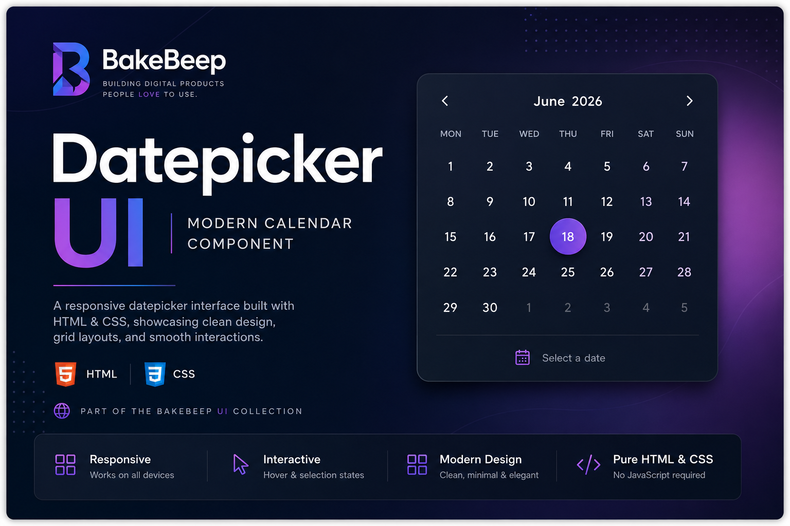

# Datepicker UI

> A modern calendar interface built with HTML and CSS.




---

## Overview

Datepicker UI is a responsive calendar component that demonstrates modern frontend layout techniques using only HTML and CSS.

It recreates the visual foundation of a production-ready datepicker without relying on JavaScript frameworks or external libraries.

Developed as part of the BakeBeep UI Collection.

---

## Preview

A clean calendar interface inspired by modern scheduling applications, demonstrating responsive layouts and reusable component design.

---

## Design Philosophy

The interface emphasizes simplicity, clarity, and visual hierarchy. The layout was designed to demonstrate how modern calendar components can be created using semantic HTML and CSS Grid without relying on external frameworks.

---

## Features

- Responsive calendar layout
- Clean modern interface
- Hover interactions
- Selected date state
- Muted adjacent month dates
- CSS Grid layout
- Mobile-friendly design
- Reusable component structure

---

## Technologies

- HTML5
- CSS3
- CSS Grid
- Custom Properties
- Hover Transitions
- Aspect Ratio

---

## Project Structure

```text
datepicker/
│
├── assets/
├── css/
├── index.html
└── README.md
```

---

## Future Improvements

- Interactive month navigation
- Dynamic date rendering
- Keyboard accessibility
- Touch gesture support
- Dark mode
- Internationalization
- Date range selection
- Packaging as a reusable component

---

## Live Demo

https://datepicker-mu.vercel.app/
---

## License

MIT License.

---

## About BakeBeep

BakeBeep is a software studio building modern web interfaces, reusable UI systems, and developer-focused digital products.

Learn more through the repositories on this GitHub profile.